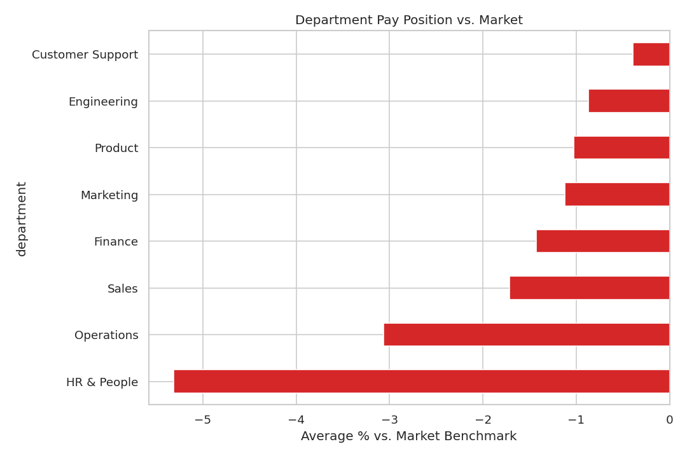
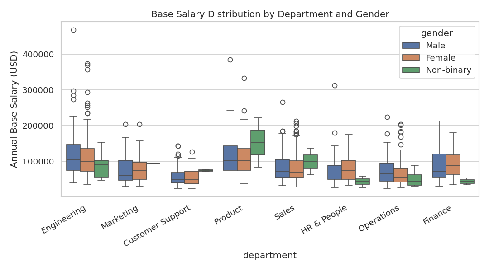
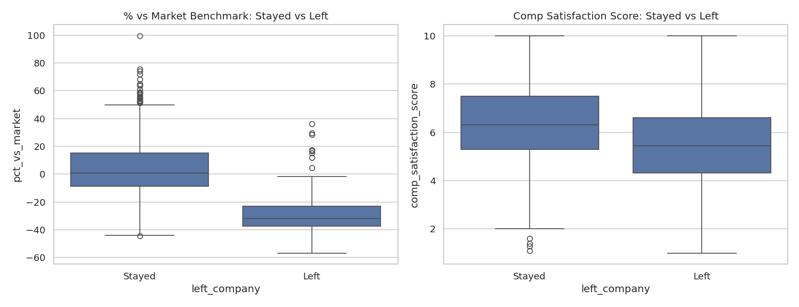
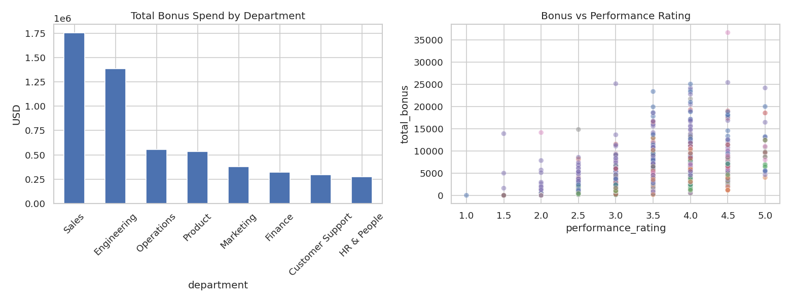

# Bonus & Comp Transparency Suite

A People Analytics portfolio project that tackles two chronic comp & benefits problems:

1. **"How was my bonus calculated?"** — employees who can't or don't self-serve through the HRIS end up asking the payroll/comp team directly, one conversation at a time.
2. **Is our pay actually fair and competitive?** — comp leaders need a fast, honest read on pay equity, market position, and whether comp is driving attrition, without a full audit engagement.

Built with 5+ years of hands-on payroll, compensation, and benefits experience, translated into a working analytics + AI agent build.

**What kind of "agent" this is:** `PeopleOpsAgent` perceives a message, decides which tool to call (bonus calculator, payslip generator, or policy Q&A), and takes that action — a genuine tool-using agent, not just a script. It's a reactive, single-turn agent (one message in, one routed response out), not a fully autonomous multi-step agent that plans and chains actions on its own. Worth being precise about that distinction rather than overselling it.

**Architecture note — this sits on top of an HRIS, it doesn't replace one:** in a real deployment, the bonus and payroll numbers should always come from the company's actual system of record (e.g. Oracle Fusion HCM, Workday, SAP SuccessFactors, BambooHR — this project is written against any of them equally, Oracle is just one reference point) rather than being recalculated independently. This project's value is the explanation and self-serve layer on top of that system — translating an already-calculated number into a plain-English "here's why," which most HRIS self-service portals don't do well — not a replacement payroll engine. See `bonus_engine.py`'s docstring for where the "swap in a real HRIS" seam would go.

## What's in here

| File | What it does |
|---|---|
| `generate_data.py` | Generates 1,200 fully synthetic employee records (no real company/personal data) — salary, department, level, location, performance, gender, tenure, and the raw inputs needed for a multi-component bonus. |
| `bonus_engine.py` | The transparent, auditable bonus calculation engine: Performance Bonus, Sales Commission (with accelerator), Retention Bonus, and Spot Bonus — each with a machine-generated plain-English explanation. In production, this logic mirrors/validates against the HRIS's payroll calculation rather than being the payroll system of record. |
| `paye_nigeria.py` | Real Nigeria PAYE tax calculation under the Nigeria Tax Act 2025 (effective 1 Jan 2026) — progressive bands, pension, NHF, and rent relief, isolated in its own module so a future tax law change is a small, auditable edit rather than a rewrite. |
| `analysis.ipynb` | The analytics notebook: pay equity (raw + regression-adjusted gender gap), market benchmarking by department/level, attrition-vs-comp analysis (with a logistic regression), and bonus pool distribution. |
| `people_ops_agent.py` | The **People Ops Agent** — a tool-using agent that explains an employee's bonus, generates a payslip PDF on demand, and answers general people-ops questions. General Q&A calls the Claude API (Messages API) with the company policy library as context when an API key is configured, and falls back to reliable keyword matching with zero setup otherwise. |
| `payslip_generator.py` | Generates a clean PDF payslip for any employee on demand, using real Nigeria PAYE for Nigeria-based employees and a clearly-flagged simplified stand-in elsewhere. |
| `company_policies.py` | Synthetic company policy knowledge base the agent draws on for general Q&A (and passes to Claude as context when the API is active). |
| `people_ops_agent_demo.ipynb` | Runnable demo of the agent in action, including the full multi-component bonus breakdown. |

## Analytics preview

| Market benchmark by department | Pay by department & gender |
|---|---|
|  |  |

| Attrition vs. comp | Bonus pool distribution |
|---|---|
|  |  |

## Why this scope

This isn't a generic "HR dashboard" — it's built around a specific, recurring pain point from real comp & benefits work: employees don't trust or understand bonus numbers unless someone walks them through it, and that walkthrough is usually a manual, one-off Slack/email conversation. The agent automates that conversation. The notebook automates the upstream question comp leaders should be asking before employees even complain: is the pay actually fair and competitive in the first place.

## How to run it

```bash
pip install pandas numpy faker matplotlib seaborn scipy statsmodels reportlab jupyter anthropic

python3 generate_data.py          # creates hr_bonus_dataset.csv
python3 bonus_engine.py           # creates hr_bonus_dataset_with_bonus.csv
jupyter nbconvert --to notebook --execute --inplace analysis.ipynb
jupyter nbconvert --to notebook --execute --inplace people_ops_agent_demo.ipynb
```

Or open `analysis.ipynb` / `people_ops_agent_demo.ipynb` directly in Jupyter/VS Code/Google Colab and run cell by cell.

To enable the Claude-powered open-ended Q&A (optional — the agent runs perfectly well without it, using keyword matching instead), copy `.env.example` to `.env`, add your own key, and export it (e.g. `export ANTHROPIC_API_KEY=sk-...` or load it with `python-dotenv`) before running. No key means no API calls; the agent silently falls back to keyword search.

## Methodology notes

- **Pay equity:** uses OLS regression on log salary, controlling for department, level, location, and tenure, to isolate the residual gender gap not explained by legitimate pay drivers — the standard approach in real pay equity audits. The notebook is explicit about the difference between a sample-level % gap and statistical significance (α = 0.05) — with a `Non-binary` subgroup of only N = 31, that distinction matters before anyone reads a headline number as a settled finding.
- **Market benchmarking:** `role_median_salary` and the synthetic `market_benchmark_salary` are computed within department + level + **location** groups, not just department + level. Salaries carry a real geographic multiplier (Lagos ≈ 1.0x vs. Remote - US ≈ 1.85x), so benchmarking without location would make every Nigeria-based employee look underpaid and every high-cost-location employee look overpaid purely from geography, not from any actual pay decision.
- **Attrition:** uses logistic regression on synthetic "left company" outcomes against market position, comp satisfaction, performance, and tenure. Flagged transparently in the notebook and in `generate_data.py`: the synthetic attrition label is generated as a noisy function of those same variables, so the regression largely recovers its own generating formula — it demonstrates the methodology you'd apply to real HRIS data, not an independently discovered effect.
- **Bonus engine:** every component is a documented formula with a version tag (`FY2026 Bonus Plan v1.0`), so any number can be traced back to the exact rule that produced it — the whole point of the project. Performance and Retention bonuses are pro-rated for employees with under a year of tenure; Commission and Spot Bonus are not, since they're already tied to actual attainment or a one-off event rather than accrued service time.

## Known limitations

- **Synthetic data only.** Every number in this repo — salaries, ratings, attrition outcomes — is generated by `generate_data.py`, seeded for reproducibility. No real company or person data was used anywhere.
- **Attrition model is methodology, not a finding.** `left_company` is generated as a noisy function of the same variables the logistic regression uses as predictors, so its coefficients demonstrate the *approach* you'd apply to real HRIS data, not an independently discovered effect (see the Methodology notes below and the caveat in `generate_data.py`).
- **Non-Nigeria payslip tax is illustrative only.** Only Nigeria-based payslips (Lagos, Abuja, Port Harcourt) use real tax law (the Nigeria Tax Act 2025). UK/Canada/US remote payslips use a simplified flat-rate stand-in, clearly flagged on the payslip itself — not real local tax law.
- **This sits on top of an HRIS, it doesn't replace one.** In a real deployment, bonus and payroll figures should come from the actual system of record; this project's value is the explanation/self-serve layer on top of that system, not a payroll engine of record.
- **Reactive, single-turn agent.** `PeopleOpsAgent` routes one message to one action — it isn't a multi-step autonomous agent that plans and chains actions on its own.

## Roadmap / what I'd build next

- Connect to a real HRIS/payroll API (Oracle Fusion, Workday, SAP SuccessFactors, etc.) instead of a static CSV, with this project's bonus/PAYE logic used to validate against the HRIS's own calculation rather than replace it.
- Add employee authentication so people can only query their own record.
- Ship the agent as a Slack/Teams bot.
- Extend the equity analysis to intersectional gaps (e.g. gender × location).
- Add prompt caching on the policy context to reduce Claude API cost further at scale (the policy library rarely changes, so it's a good caching candidate).
- Replace the synthetic, formula-derived attrition label with a less circular DGP (or, on real data, run the standard leakage checks) so the attrition-comp coefficients read as a genuine finding rather than a methodology demo.

**On cost at scale:** the Claude API side of this is inexpensive even at thousands of employees, because only open-ended Q&A calls the API — bonus and payslip generation are deterministic Python with zero inference cost. At current published Claude pricing, a company of ~5,000 employees generating tens of thousands of open-ended questions a year would land in the low hundreds of dollars annually for the AI itself; the larger cost in a real rollout is HRIS integration, security/compliance review, and hosting — not the model.

## About this project

Built by Moh Okunlola — Masters student in Economic Intelligence (Behavioural & Digital Economics for Effective Management), transitioning from 5+ years in Compensation, Benefits & Payroll into People Analytics / Data Analytics. Built end-to-end using Claude (Cowork) as a hands-on way to learn applied AI development.
